# Unfilter

Unfilter uncovers the technology stack behind the apps on your phone.

It scans your installed applications and detects if they are built with native tools or cross-platform frameworks like Flutter, React Native, Kotlin Multiplatform, Unity, and more.

## Capabilities

- **Stack Detection**: Identifies the development framework (Flutter, React Native, etc).
- **Task Manager**: Real-time view of active processes and memory usage.
- **Storage & Usage**: Detailed analysis of app size, cache, and daily screen time.
- **System Info**: Overview of device sensor data, battery health, and hardware specs.
- **Clean UI**: Minimalist design with full dark and light mode support.

## Gallery

### Home & Menu

  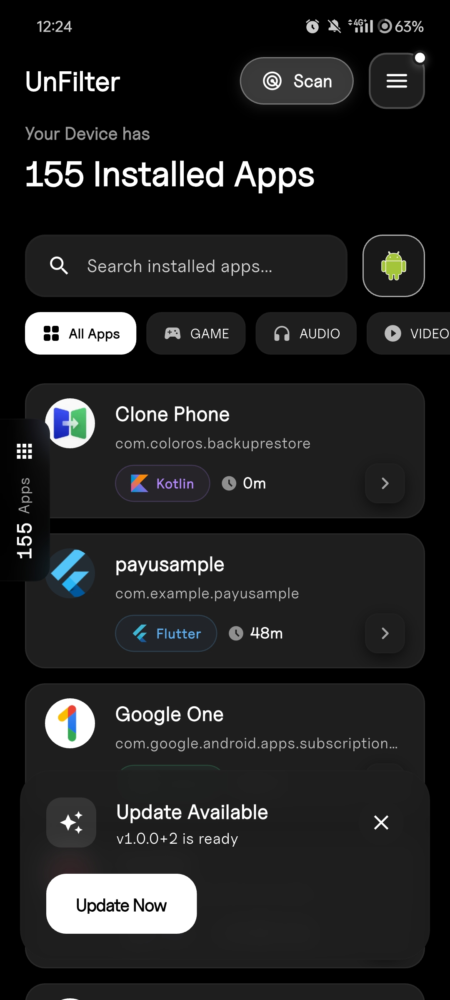
  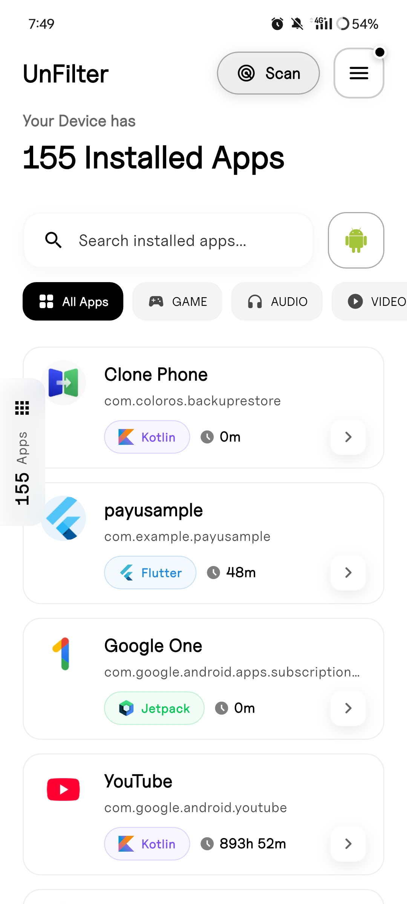 

  
  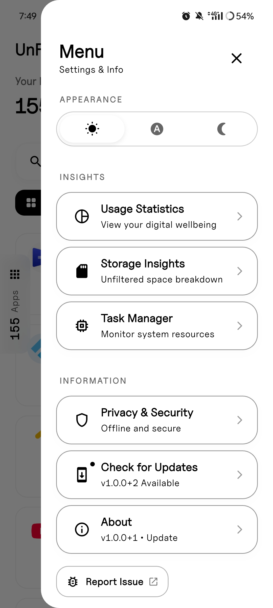 

### Discovery (Search & Filter)

  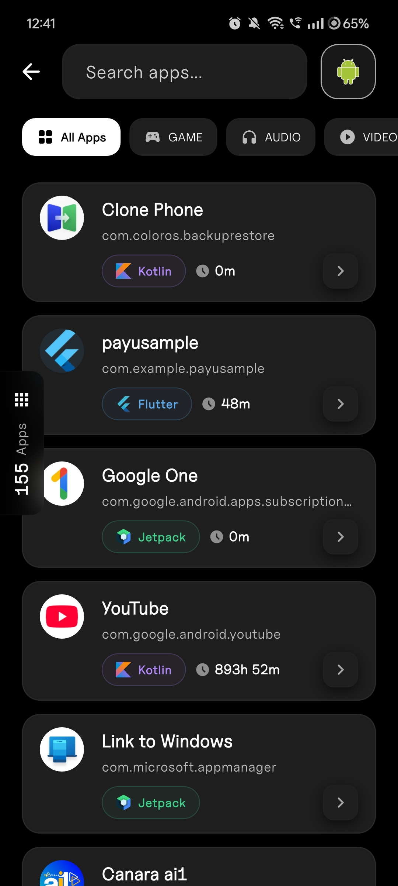
  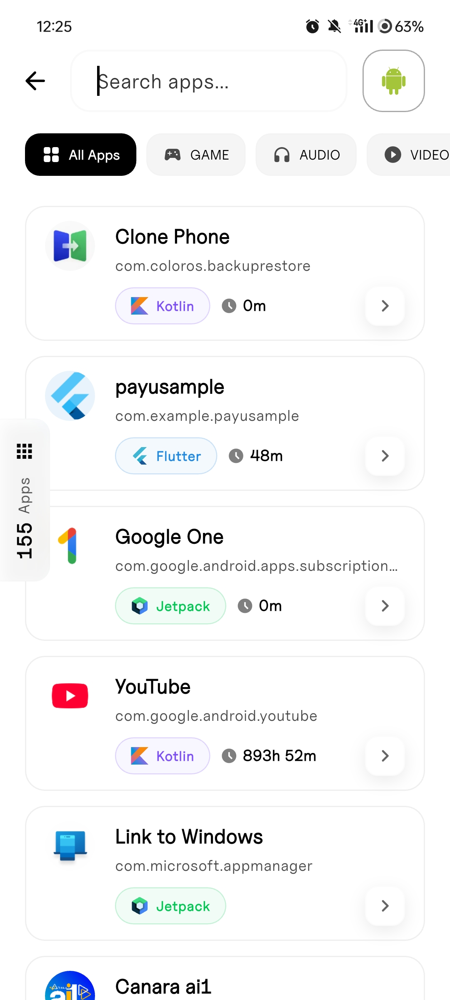 

  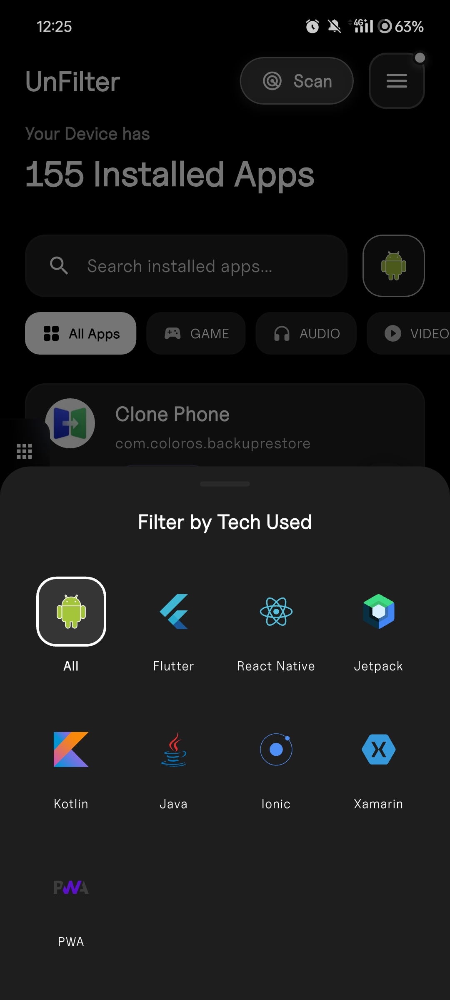
  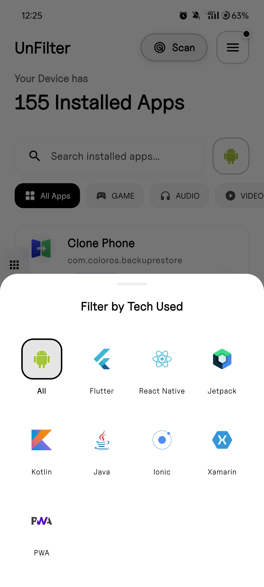 

### Task Manager & Updates

  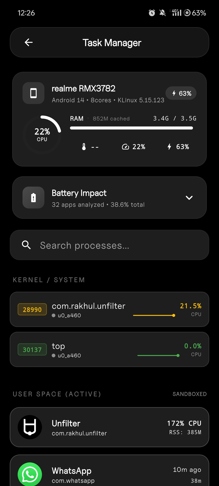
  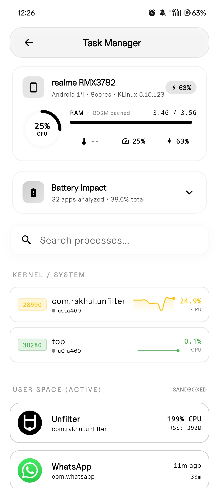 

  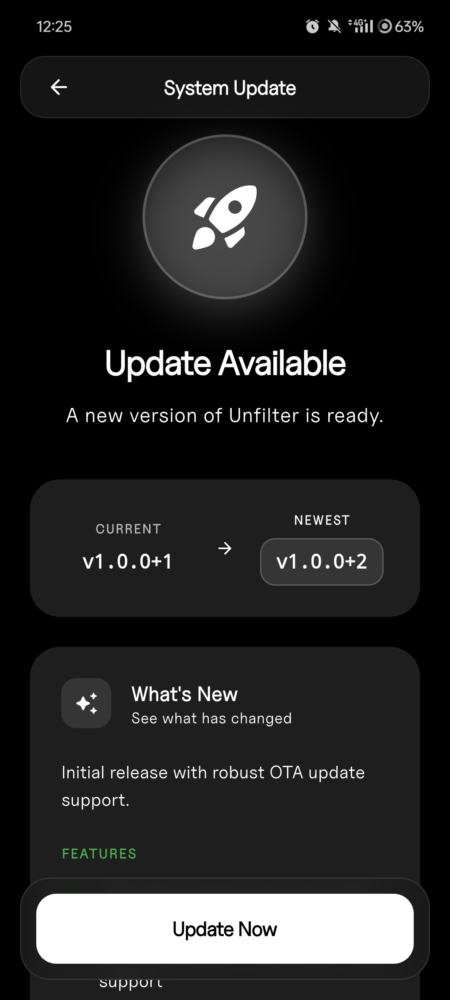
  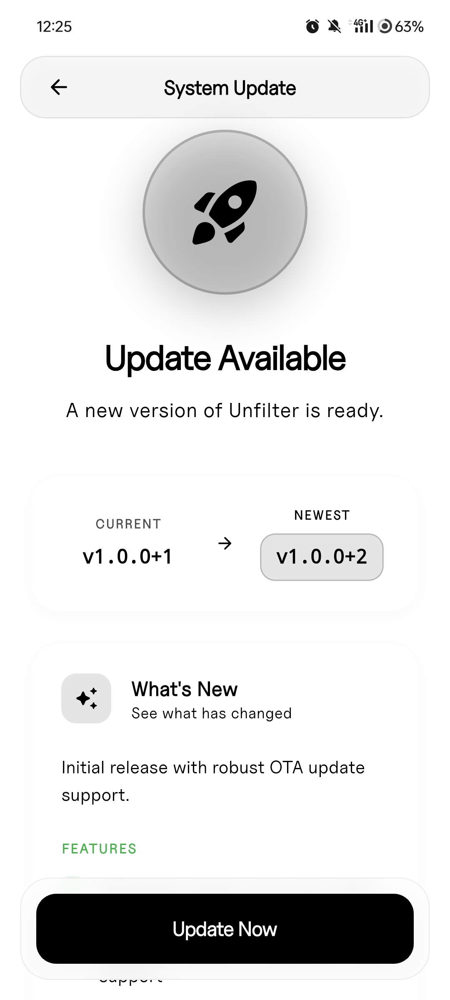 

### Analytics (Storage & Usage)

  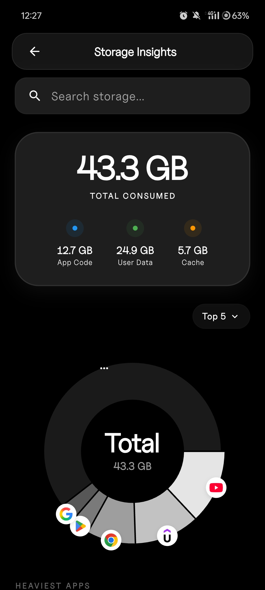
  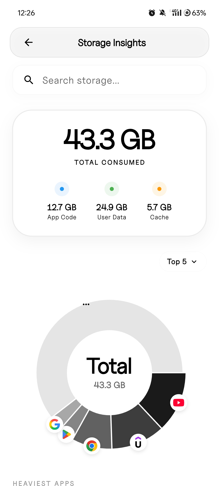 

  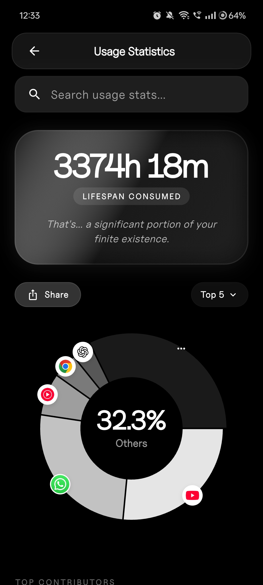
  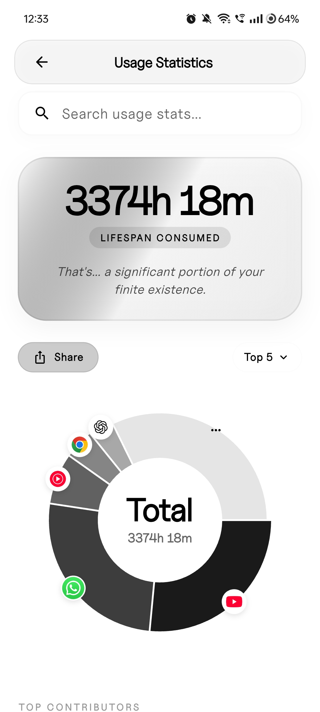 

### App Inspection

  
  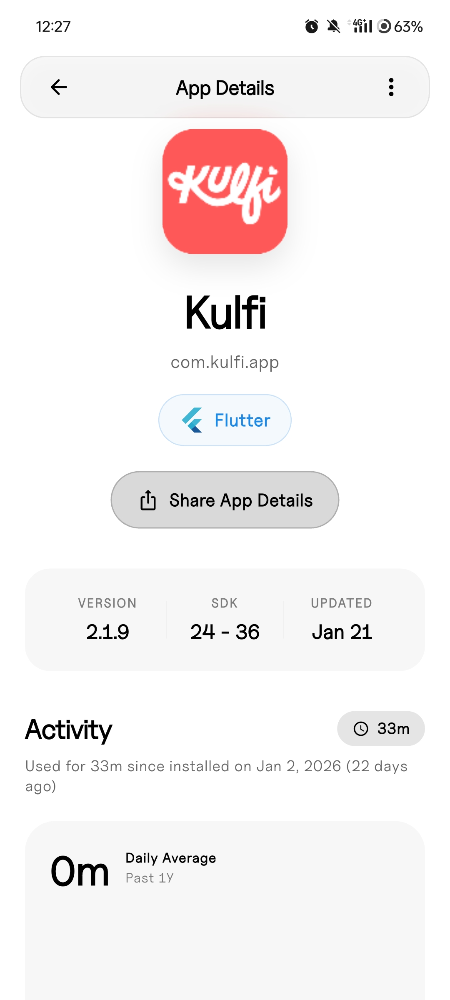 

## Installation

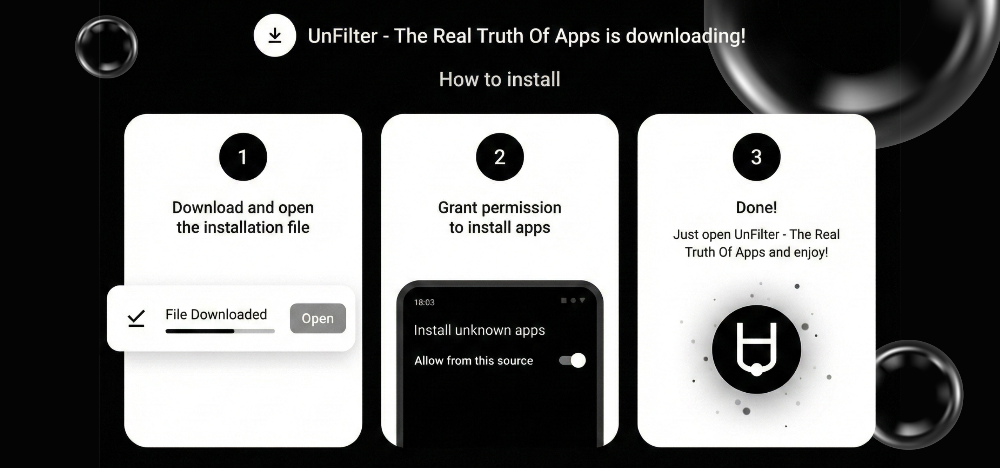

## Download

Get the latest APK from the releases section.
