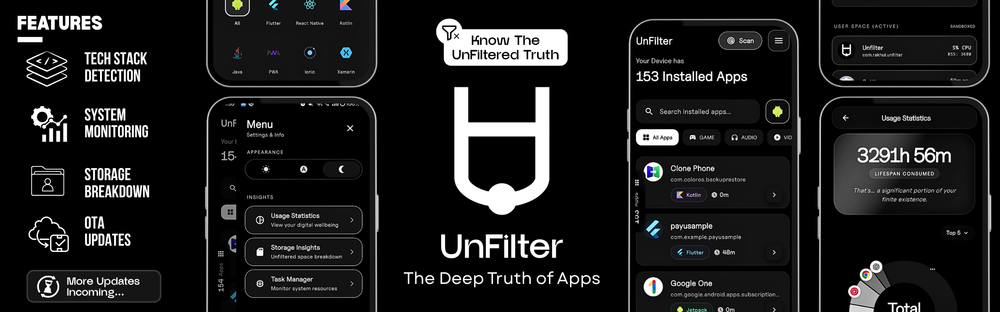

## Unfilter - The Real Truth Of Apps 

Unfilter is a simple tool I built to help you see what's under the hood of the apps on your phone.

As a developer (or just a curious techie), you might often wonder, _"Is this app built with Flutter? Or is it React Native?"_. Unfilter answers that question for you instantly.

## What does it actually do?

It scans all the apps installed on your device and "unfilters" the technology behind them.

- **See the Tech Stack:** It tells you if an app uses **Flutter**, **React Native**, **Jetpack Compose**, **Unity**, and many others.
- **Deep Dive:** You can click on any app to see more details like its package name, version, and exactly how much storage it's using.
- **Clean & Simple:** I designed it to be really easy to use and look good while doing it.

## Who is this for?

If you are learning to code, it's super cool to see what frameworks popular apps are using. If you are just curious about your device, it gives you a nice overview of your installed apps and system stats.

Enjoy exploring!
